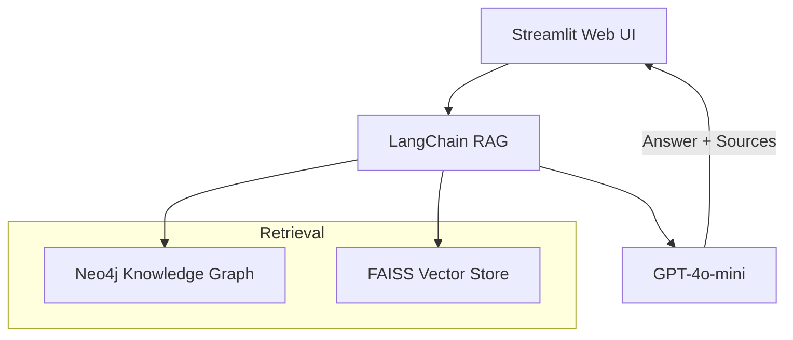

# 🏥 MediGraph – AI-Powered Medical Knowledge-Graph Q&A

[](https://www.python.org/downloads/) 
[](https://neo4j.com/) 
[](https://openai.com/) 
[](https://streamlit.io/)

> **Ask any medical question in plain English and get an evidence-based answer with clickable citations — all processed locally on your machine.**
>
> *Disclaimer: Information is for educational purposes only. Always consult a healthcare professional.*

---

## ✨ Key Benefits (for everyone)

| Benefit | What it means |
|---------|---------------|
| Reliable | Answers are built from FDA drug labels & PubMed abstracts — no hallucinations. |
| Transparent | Every answer lists the exact sources used. |
| Fast & private | ~2 s average latency, all data stays on your computer. |
| Free | Runs with free Neo4j + OpenAI API tier. |

---

## 🚀 3-Step Quick Start (⏱ < 5 min)

```bash
# 1) Clone & install
$ git clone https://github.com/SophieXueZhang/MediGraph-RAG.git
$ cd med-graph-rag
$ pip install -r requirements.txt

# 2) Launch Neo4j in Docker (username: neo4j / password: password)
$ docker run --name neo4j-medical -d -p7474:7474 -p7687:7687 \
    -e NEO4J_AUTH=neo4j/password neo4j:2025.06.0

# 3) Run the UI (port 8506)
$ export OPENAI_API_KEY="<your key>"
$ streamlit run rag/streamlit_app_premium.py --server.port 8506
```
Then open <http://localhost:8506> in your browser and ask for *"What medications treat hypertension?"* — the right panel shows supporting documents.

---

## 🛠️ How It Works (1-slide view)



---

## 🧑‍💻 Tech Stack (for developers)

* **LLM** – OpenAI GPT-4o-mini
* **Retrieval** – LangChain Retrieval-QA + FAISS vectors (OpenAI embeddings)
* **Database** – Neo4j 2025.06.0
* **Frontend** – Streamlit 1.37 (standard & premium themes)

---

## 📂 Project Structure

```text
med-graph-rag/
├── rag/
│   ├── __init__.py
│   ├── qa_chain.py
│   ├── streamlit_app.py
│   └── streamlit_app_premium.py
├── graph/
│   ├── ingest.py
│   └── schema.cypher
├── models/
│   └── simcse_medical/
│       ├── config.json
│       ├── ner_improvement_results.json
│       ├── special_tokens_map.json
│       ├── tokenizer.json
│       ├── tokenizer_config.json
│       └── vocab.txt
├── nlp/
│   └── __init__.py
├── scripts/
│   └── __init__.py
├── data/               # placeholder for datasets
├── arxiv_paper_draft.md
├── PERFORMANCE_EVALUATION_SUMMARY.md
├── requirements.txt
└── README.md
```

---

